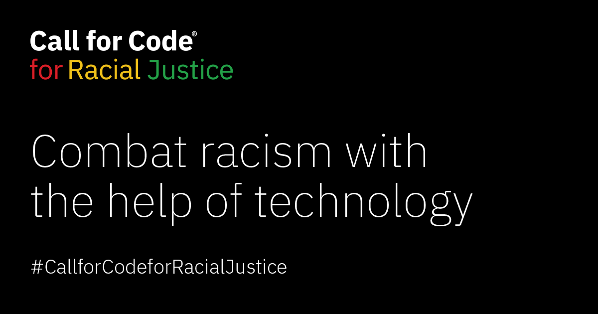
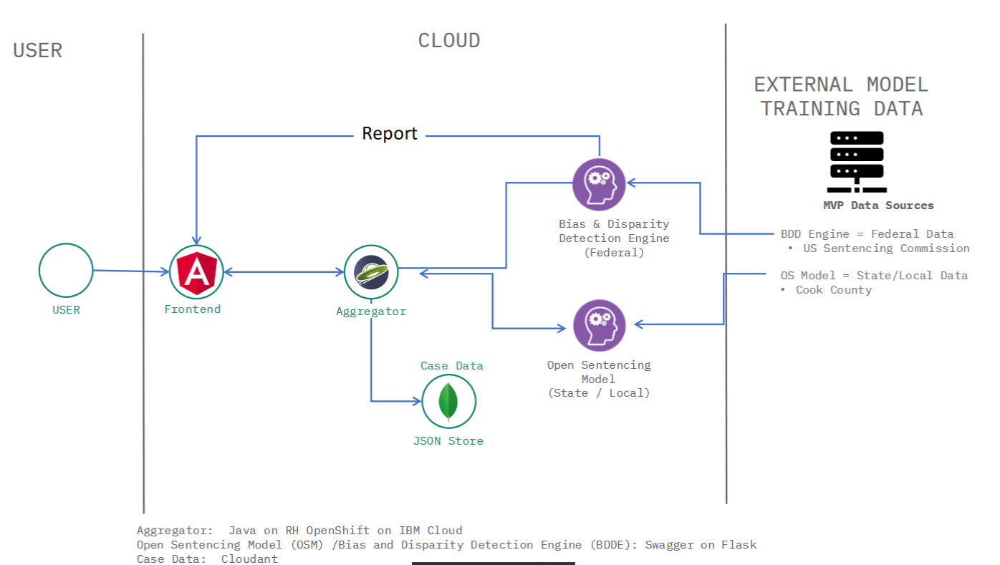

[](https://www.apache.org/licenses/LICENSE-2.0) [](https://callforcode.org/slack) [](https://call-for-code-for-racial-justice.github.io/Hacktoberfest/#/?id=main)

## Call for Code for Racial Justice
A project for the 2020 Call for Code Challenge seeking technology solutions for racial injustice.



<p align="center">
    <a href="https://developer.ibm.com/callforcode/racial-justice/get-started/">
        
    </a>
</p>

<p align="center">
    <a href="https://developer.ibm.com/callforcode/racial-justice/get-started/">
    
    </a>
    
    
</p>

### What's the problem?
Black defendants face harsher sentences than people of other races for similar offenses (e.g. harged at higher rates, assigned more significant charges, convicted at higher rates, given longer sentences, and denied parole more often).

### How can technology help?
We built a statistical model that estimates the additional years of prison that a non-white defendant will face in a particular case. This tool allows public defenders and other criminal legal system actors to intervene in a particular case before an unequal sentence is handed down. The model also helps public defenders identify factors that lead most often to racial sentencing discrepancies.

### Data Set
[Cook County Sentencing data set](https://datacatalog.cookcountyil.gov/Courts/Sentencing/tg8v-tm6u/data) used in the Open Sentencing model.

### Roadmap and Architecture
This project will ultimately be presented as a component of a group of projects that will generate other predictions, capture new data, and generate reports.  The architecture of the complete system is shown below.  



### Machine Learning Algorithm
   
1) Build a model to predict prison sentence length based on a range of factors including race and criminal charge.
2) For a given charge, predict the sentence length. Then switch the race variable from non-White to White or White to Black and make the same prediction.
3) Calculate the discrepancy between the predicted sentence length with the actual race and the predicted sentence length with the counterfactual race.
4) Report the size of the estimated discrepancy in sentencing due to race and the relative severity of the discrepancy compared to past examples. 

See the [Notebooks](/notebooks/) folder in this repository for detailed Jupyter notebooks that demostrate how the model was trained and allow you to re-train the model yourself.


# Create and deploy a Python Flask application

> We have applications available for [Node.js Express](https://github.com/IBM/node-express-app), [Go Gin](https://github.com/IBM/go-gin-app), [Python Flask](https://github.com/IBM/python-flask-app), [Python Django](https://github.com/IBM/python-django-app), [Java Spring](https://github.com/IBM/java-spring-app), [Java Liberty](https://github.com/IBM/java-liberty-app), [Swift Kitura](https://github.com/IBM/swift-kitura-app), [Android](https://github.com/IBM/android-app), and [iOS](https://github.com/IBM/ios-app).

In this sample application, you will create a Python cloud application using Flask. This application contains an opinionated set of files for web serving:

- `public/index.html`
- `public/404.html`
- `public/500.html`

This application also enables a starting place for a Python microservice using Flask. A microservice is an individual component of an application that follows the **microservice architecture** - an architectural style that structures an application as a collection of loosely coupled services, which implement business capabilities. The microservice exposes a RESTful API matching a [Swagger](http://swagger.io) definition.

## Steps

You can [deploy this application to IBM Cloud](https://cloud.ibm.com/developer/appservice/starter-kits/python-flask-app) or [build it locally](#building-locally) by cloning this repo first. After your app is live, you can access the `/health` endpoint to build out your cloud native application.

### Deploying to IBM Cloud

<p align="center">
    <a href="https://cloud.ibm.com/developer/appservice/starter-kits/python-flask-app">
    
    </a>
</p>

Click **Deploy to IBM Cloud** to deploy this same application to IBM Cloud. This option creates a deployment pipeline, complete with a hosted GitLab project and a DevOps toolchain. You can deploy your app to Cloud Foundry, a Kubernetes cluster, or a Red Hat OpenShift cluster. OpenShift is available only through a standard cluster, which requires you to have a billable account.

[IBM Cloud DevOps](https://www.ibm.com/cloud/devops) services provides toolchains as a set of tool integrations that support development, deployment, and operations tasks inside IBM Cloud.

### Building locally

To get started building this application locally, you can either run the application natively or use the [IBM Cloud Developer Tools](https://cloud.ibm.com/docs/cli?topic=cloud-cli-getting-started) for containerization and easy deployment to IBM Cloud.

#### Native application development

* Install [Python](https://www.python.org/downloads/)
 
Running Flask applications has been simplified with a `manage.py` file to avoid dealing with configuring environment variables to run your app. From your project root, you can download the project dependencies with (NOTE: If you don't have pipenv installed, execute: `pip install pipenv`):

```bash
pipenv install
```

To run your application locally:

```bash
python manage.py start
```

`manage.py` offers a variety of different run commands to match the proper situation:
* `start`: starts a server in a production setting using `gunicorn`.
* `run`: starts a native Flask development server. This includes backend reloading upon file saves and the Werkzeug stack-trace debugger for diagnosing runtime failures in-browser.
* `livereload`: starts a development server via the `livereload` package. This includes backend reloading as well as dynamic frontend browser reloading. The Werkzeug stack-trace debugger will be disabled, so this is only recommended when working on frontend development.
* `debug`: starts a native Flask development server, but with the native reloader/tracer disabled. This leaves the debug port exposed to be attached to an IDE (such as PyCharm's `Attach to Local Process`).

There are also a few utility commands:
* `build`: compiles `.py` files within the project directory into `.pyc` files
* `test`: runs all unit tests inside of the project's `test` directory

Your application is running at: `http://localhost:3000/` in your browser.
- Your [Swagger UI](http://swagger.io/swagger-ui/) is running on: `/explorer`
- Your Swagger definition is running on: `/swagger/api`
- Health endpoint: `/health`

There are two different options for debugging a Flask project:
1. Run `python manage.py runserver` to start a native Flask development server. This comes with the Werkzeug stack-trace debugger, which will present runtime failure stack-traces in-browser with the ability to inspect objects at any point in the trace. For more information, see [Werkzeug documentation](http://werkzeug.pocoo.org/).
2. Run `python manage.py debug` to run a Flask development server with debug exposed, but the native debugger/reloader turned off. This grants access for an IDE to attach itself to the process (i.e. in PyCharm, use `Run` -> `Attach to Local Process`).

You can also verify the state of your locally running application using the Selenium UI test script included in the `scripts` directory.

> **Note for Windows users:** `gunicorn` is not supported on Windows. You may start the server with `python manage.py run` on your local machine or build and start the Dockerfile.

#### IBM Cloud Developer Tools

Install [IBM Cloud Developer Tools](https://cloud.ibm.com/docs/cli?topic=cloud-cli-getting-started) on your machine by running the following command:
```
curl -sL https://ibm.biz/idt-installer | bash
```

Create an application on IBM Cloud by running:

```bash
ibmcloud dev create
```

This will create and download a starter application with the necessary files needed for local development and deployment.

Your application will be compiled with Docker containers. To compile and run your app, run:

```bash
ibmcloud dev build
ibmcloud dev run
```

This will launch your application locally. When you are ready to deploy to IBM Cloud on Cloud Foundry or Kubernetes, run one of the commands:

```bash
ibmcloud dev deploy -t buildpack // to Cloud Foundry
ibmcloud dev deploy -t container // to K8s cluster
```

You can build and debug your app locally with:

```bash
ibmcloud dev build --debug
ibmcloud dev debug
```

### Running the Examples and Calling the API?
Please find the notebook used to build the model [here](notebooks/Explore and Train - reader friendly.ipynb).  Another notebook outlining how to make predictions with a pretrained model is [here](notebooks/calling_api_and_comparing_results.ipynb)

If the service is cloud deployed be sure to point to the IP and port associated witht the deployment.  Examples here are provided for deployment on `localhost:3000`.


You can then use [Postman app](https://www.postman.com/downloads/) to send json formatted POST HTTP requests to the model at the URL `http://127.0.0.1:3000/predict`
Here is an example JSON data you can use to test the model.
```
{
	"PRIMARY_CHARGE_FLAG":false,
	"DISPOSITION_CHARGED_OFFENSE_TITLE":"[POSSESSION OF CONTROLLED SUBSTANCE WITH INTENT TO DELIVER\/ DELIVERY OF A CONTROLLED SUBSTANCE]",
	"CHARGE_COUNT":2,"DISPOSITION_CHARGED_CLASS":"2",
	"CHARGE_DISPOSITION":"Plea Of Guilty",
	"SENTENCE_JUDGE":"Maura  Slattery Boyle",
	"SENTENCE_PHASE":"Original Sentencing","SENTENCE_TYPE":"Prison",
	"COMMITMENT_TERM":3.0,"COMMITMENT_UNIT":"Year(s)", "LENGTH_OF_CASE_in_Days":336.0,
	"AGE_AT_INCIDENT":52.0,"RACE":"Black","GENDER":"Female","INCIDENT_CITY":"Chicago",
	"LAW_ENFORCEMENT_AGENCY":"CHICAGO PD",
	"LAW_ENFORCEMENT_UNIT":"District 25 - Grand Central",
	"UPDATED_OFFENSE_CATEGORY":"Narcotics"
}
```
#### From the Command Line
Run the following command line curl command

```asciidoc
curl -X POST -H "Content-Type: application/json" -d '{"PRIMARY_CHARGE_FLAG":false,"DISPOSITION_CHARGED_OFFENSE_TITLE":"[POSSESSION OF CONTROLLED SUBSTANCE WITH INTENT TO DELIVER\/ DELIVERY OF A CONTROLLED SUBSTANCE]","CHARGE_COUNT":2,"DISPOSITION_CHARGED_CLASS":"2","CHARGE_DISPOSITION":"Plea Of Guilty","SENTENCE_JUDGE":"Maura  Slattery Boyle","SENTENCE_PHASE":"Original Sentencing","SENTENCE_TYPE":"Prison","COMMITMENT_TERM":3.0,"COMMITMENT_UNIT":"Year(s)","LENGTH_OF_CASE_in_Days":336.0,"AGE_AT_INCIDENT":52.0,"RACE":"Black","GENDER":"Female","INCIDENT_CITY":"Chicago","LAW_ENFORCEMENT_AGENCY":"CHICAGO PD","LAW_ENFORCEMENT_UNIT":"District 25 - Grand Central","UPDATED_OFFENSE_CATEGORY":"Narcotics"}' localhost:3000/predict
```

You should get the following result

```asciidoc
{
  "model_name": "sentence_pipe_mae1.555_2020-10-10_02h46m24s",
  "sentencing_discrepancy": 0.211,
  "severity": 0.555
}
```
The `model_name` is the file name (with `.pkl` extension) of the model file used to make the prediction.  Discrepancy and Severity are discussed in the notebook (Add notebook link here).  See also [Calling API and Comparing Results](notebooks/calling_api_and_comparing_results.ipynb), for details on how the data is generated.


## Next steps
* Learn more about the services and capabilities of [IBM Cloud](https://cloud.ibm.com).
* Explore other [sample applications](https://cloud.ibm.com/developer/appservice/starter-kits) on IBM Cloud.

## License

This sample application is licensed under the Apache License, Version 2. Separate third-party code objects invoked within this code pattern are licensed by their respective providers pursuant to their own separate licenses. Contributions are subject to the [Developer Certificate of Origin, Version 1.1](https://developercertificate.org/) and the [Apache License, Version 2](https://www.apache.org/licenses/LICENSE-2.0.txt).

[Apache License FAQ](https://www.apache.org/foundation/license-faq.html#WhatDoesItMEAN)

